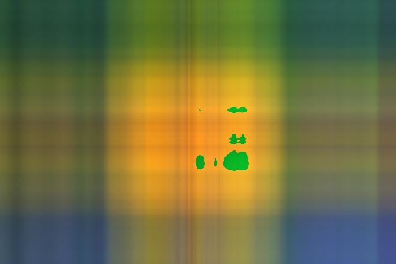
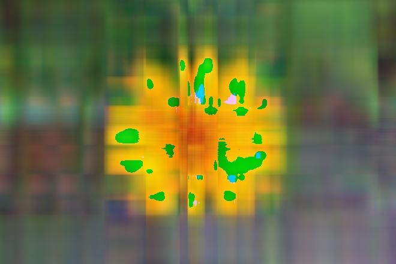

## Image Compression using Singular Value Decomposition
---

|original|rank=1|rank=5|rank=20|rank=50|
|:-:|:-:|:-:|:-:|:-:|
||||||

- svd를 위해 사용할 함수는 np.linalg.svd 함수. 
- A = U * Sigma * V^T. 
- U는 A와 A^T를 곱했을 때 나오는 매트릭스의 eigenvector 행렬인 left singular vector이다. 
- V^T는 A^T와 A를 곱했을 때 나오는 매트릭스의 eigenvector 행렬인 right singular vector이다. 두 singular vector 모두 symmetric하다.
- 두 singular vector 모두 같은 eigenvalue를 가지며, Sigma는 이 eigenvalue의 루트값이다. 
- Sigma는 eigenvector들로 따로 차원없이 내림차순 정렬되어있다.
- symmetric한 매트릭스는 eigenvector들 간 orthogonal하고, 원래 값을 rotation to eigenbasis, scale, rotation back to basis로 이루어진 SVD가 성립할 수 있는 이유가 된다.
- SVD는 어떠한 matrix에서도 적용될 수 있다는 점에서, symmetric한 매트릭스만 적용 가능한 Spectral Decomposition의 좀 더 general한 케이스라고 할 수 있다.
- SVD로 분해한 값은 다시 U의 column과 해당 Sigma index값, 그리고 V^T의 row의 outer product들의 합으로 나눌 수 있다.
- 이미지 하나를 표현하기 위해 w*h만큼의 숫자가 필요한 반면에, outer product로 분해한 후, 영향력이 큰 값으로만 근사하면, w+h만큼의 숫자만 있어도 이미지 표현이 가능한 것이다.
- eigenvalue, Sigma의 인덱스값이 클수록 영향력이 크다는 것을 의미한다.

